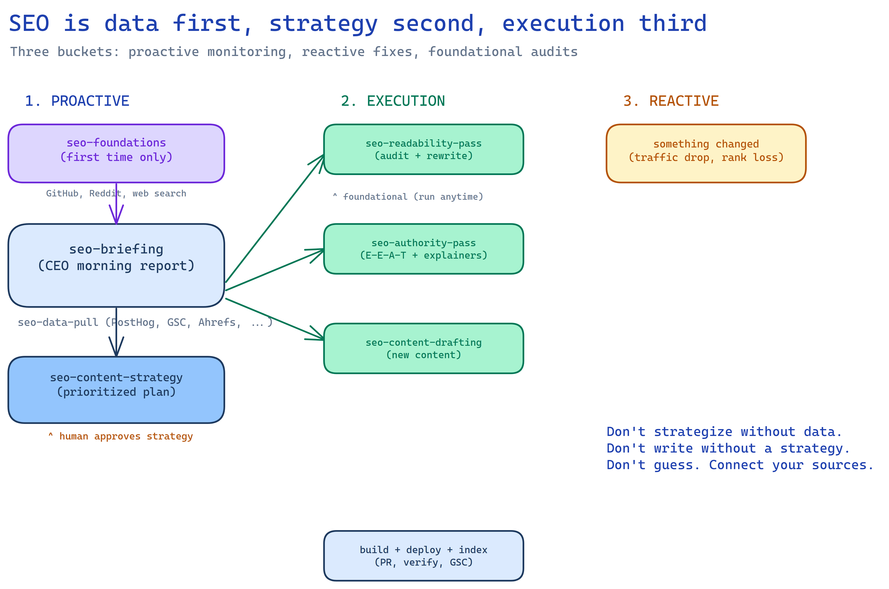

# SEO Agent Skills

> **This is a snapshot.** I copied these out of my working setup on
> September 29, 2026 to share with a friend, and I won't keep this repo
> updated. Fork it and make it yours.



## What this is

These are AI agent skills for SEO. You give them to Claude or Codex, and they handle the work: pulling your analytics, figuring out what's working and what's not, rewriting copy that doesn't sound right, creating explainer pages, adding author credentials, and drafting new content.

Each skill is one step in the process. You can run one by itself, or chain them together for a full SEO cycle.

## Install

```bash
git clone https://github.com/parsakhaz/seo-skills.git

# Claude Code
cp -R seo-skills/skills/* ~/.claude/skills/

# Codex
cp -R seo-skills/skills/* ~/.codex/skills/
```

Then open your agent in your website's repo and ask for what you want, like "set up SEO for this site" or "give me an SEO briefing".

## How it works, simply

There are 11 skills. They start with foundations (if you're new), then break into three buckets.

### 0. Starting from scratch (greenfield)

If you're new to SEO or onboarding a new site, start here. If you already know your competitors and search landscape, skip to step 1.

- **`seo-foundations`** crawls your website, figures out what you're selling and who it's for, then searches where your buyers look (GitHub, Reddit, Product Hunt, G2, niche forums) to find your competitors. It maps what content they have, identifies the obvious first pages to create (comparison pages, alternatives), and flags messaging gaps. It writes `.seo/foundations.md` so every skill after it has context.

At zero-to-one, traditional SEO data (Ahrefs, keyword volumes) is less useful than discovery patterns. How do real people find new tools? This skill starts there.

### 1. Know what's happening (proactive)

Before you write anything, look at the data. What pages are getting traffic? What keywords are you ranking for? What's not indexed? What are competitors doing that you're not?

- **`seo-briefing`** pulls data from your analytics (PostHog, Google Analytics, etc.), your search console (Google Search Console), and your SEO tools (Ahrefs, Semrush, etc.). It produces a single report: here's what's working, here's what's not, here's what to do about it.

- **`seo-content-strategy`** reads that report and turns it into a prioritized plan. Which pages to rewrite, which explainer pages to create, which blog posts to write, in what order.

You review the strategy. Once you approve it, the execution skills run.

### 2. Do the work (execution)

These skills don't need a briefing. You can run them anytime. But they're more useful when a strategy tells them what to focus on.

- **`seo-readability-pass`** audits your existing pages for readability. Are you using jargon nobody understands? Passive voice? Sentences that are too long? It rewrites everything to match your voice: short sentences, simple words, no tech speak unless it's explained immediately. It's careful with pages that already rank, so it won't rewrite away your keywords.

- **`seo-authority-pass`** adds E-E-A-T signals. That stands for Experience, Expertise, Authoritativeness, Trustworthiness. It's what Google looks for to decide if your content is credible. This skill creates explainer pages for hard concepts (like "what is a daemon?"), adds a glossary, builds an author page with real credentials, adds bylines with headshots and dates, and adds structured data so Google understands your pages better.

- **`seo-content-drafting`** creates new content: blog posts, landing pages, comparison pages. Each piece targets a specific keyword from the strategy, uses your voice, and includes all the SEO fundamentals (metadata, schema, OG images, author byline, internal links, external authority links). Then it submits the new URLs for indexing.

- **`seo-from-calls`** reads your customer call transcripts and finds the questions buyers asked that your site doesn't answer. Other people are searching for the same answers, so each one is a page worth writing.

### 3. React when something breaks (reactive)

Traffic dropped? Page lost rankings? Competitor launched something? Start with a briefing focused on the problem, then run whichever skill fixes it.

### After everything: organize

- **`seo-data-organize`** runs at the end. It archives your data into dated folders so you can look back at any week and see what happened. It tracks experiments (what you changed, why, and whether it worked). Over time, your `.seo/` folder becomes a searchable history of every SEO decision you've made.

## The full monthly cycle

```
0. seo-foundations            ← first time only: understand product, find competitors
1. seo-briefing               ← pull all data, see what's happening
2. seo-content-strategy       ← decide what to do (you approve this)
3. seo-readability-pass       ← fix existing copy
4. seo-authority-pass         ← add credibility signals
5. seo-content-drafting       ← create new content
6. seo-data-organize          ← archive everything, track experiments
```

You don't have to run all of them every time. Need a quick copy fix? Just run `seo-readability-pass`. Want to add explainer pages? Just `seo-authority-pass`.

## Where you spend your attention

You don't need to micromanage every step. Focus on two things:

1. **Read the briefing.** Understand what the data says.
2. **Approve the strategy.** Agree on what to create or update.

The skills handle the writing, the metadata, the structured data, the OG images, the author bylines, the internal linking, and the archiving.

## What you need to connect

These skills pull real data. The more sources you connect, the better they work. If a source isn't connected, the skill skips that part and tells you what you're missing. It never makes up numbers.

| What | Why you need it | Options |
|------|----------------|---------|
| **Analytics** | Know which pages get traffic | [PostHog](https://github.com/PostHog/posthog-mcp), Google Analytics, Plausible |
| **Search console** | Know what people search for, what's indexed | Google Search Console |
| **SEO tool** | Know your keywords, backlinks, and competitors | Ahrefs or Semrush via [Composio](https://github.com/ComposioHQ/composio) |

The copy skills (readability pass, authority pass) don't need any data. They just need your website's code and a voice guide. You can run them right now without connecting anything.

For finding more connectors: [awesome-mcp-servers](https://github.com/punkpeye/awesome-mcp-servers), [Composio](https://github.com/ComposioHQ/composio), [official MCP servers](https://github.com/modelcontextprotocol/servers).

## Where your data lives

All SEO data lives in a `.seo/` folder inside your website repo. The skills create and maintain it, and commit it so the next run can compare against the last one.

```
.seo/
  foundations.md           ← what you sell, who you compete with
  index.md                 ← table of contents (auto-generated)
  briefing.md              ← latest briefing
  strategy.md              ← latest strategy

  data/                    ← current data snapshots
    manifest.md            ← what's connected, when it was pulled
    analytics.md
    search-console.md
    seo-tool.md

  archive/                 ← dated history (one folder per run)
    2026/06/24/
      briefing.md
      strategy.md
      data/

  experiments/             ← what you changed and whether it worked
    2026-06-24-name.md
```

## Writing framework

**`seo-writing-framework`** is the process all copy skills follow for any customer-facing deliverable. You can also use it on its own for one-off writing (emails, announcements, support replies).

1. **Research** real examples of how good companies write the same type of thing
2. **Draft** with examples as reference, not from nothing
3. **Reader hat**: read the draft as the person receiving it, not the person writing it
4. **Edit**: remove LLM-isms, replace with how you'd actually say it, read it out loud
5. **Slop gate**: run `good-writing-fundamentals` in detect mode, fix what it names, re-run until clean
6. **Score** against the rubric and revise until it hits 90%

Never draft from nothing. Never ship a first draft. The LLM is a research tool and a drafting tool. It is not the writer.

**`good-writing-fundamentals`** is the line-level layer: active voice, concrete detail, direct verbs, and the AI patterns to cut. Use it on any prose before it goes out, not just SEO copy.

It has two modes. Paste a draft and it returns an edited version plus a "What changed" note. Or ask "is this AI slop?" and it names each pattern with the quoted line and a short fix, without rewriting.

### Register

Some craft moves work on a landing page and read as slop in a support reply. The framework picks a register before drafting:

- **Persuasive** (landing pages, launch emails, headlines, comparison pages): curiosity gaps allowed, two per page maximum, each one closed on the page. A deliberate ending is allowed if it's concrete.
- **Explanatory** (docs, support replies, changelogs, pricing emails, technical posts): no curiosity gaps, no kicker. End on the last concrete point or the next action.

## Model choice

Several skills say "Run with Claude Opus 4.6." When I wrote them, 4.6 was noticeably better than 4.7 and 4.8 at writing in a specific voice. Newer models may have caught up, so try whatever you like best.

## Quick reference

| Skill | Phase | What it does |
|-------|-------|-------------|
| `seo-foundations` | greenfield | Crawl site, find competitors, map search landscape |
| `seo-briefing` | proactive | Pull data from all sources, produce a report |
| `seo-content-strategy` | proactive | Turn the report into a prioritized plan |
| `seo-readability-pass` | execution | Audit and rewrite copy for voice and clarity |
| `seo-authority-pass` | execution | Add explainer pages, glossary, author, E-E-A-T |
| `seo-content-drafting` | execution | Write new blog posts, landing pages, comparisons |
| `seo-from-calls` | execution | Turn customer call questions into pages |
| `seo-writing-framework` | writing | Research, draft, reader-hat, edit, slop-gate, score |
| `good-writing-fundamentals` | writing | Edit out AI patterns, or detect them without rewriting |
| `seo-data-pull` | support | Shared data pulling (called by the other skills) |
| `seo-data-organize` | support | Archive data, track experiments, build the history |

## Credits

`good-writing-fundamentals` is adapted from Peter Yang's [no-ai-slop](https://github.com/petergyang/no-ai-slop) under the MIT license. Its `LICENSE` file is in the skill folder.
